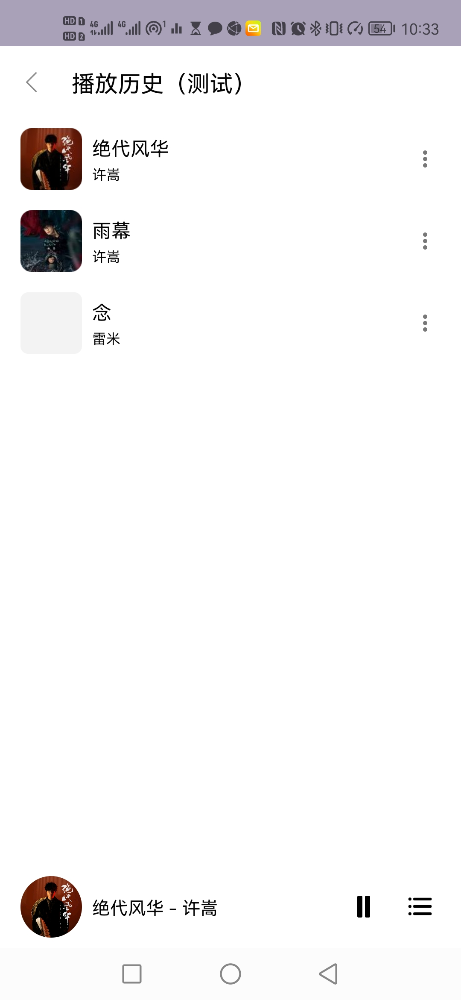

# Szong 丝竹古典音乐播放器项目简介
## 项目LOGO

## 项目需求
本项目为中南大学移动应用开发课程大项目
项目要求如下
课题内容
首页
首页分为三大块：
1. 上面为“本地音乐”、“最近播放”和“我的收藏”入口；

2. 中间为歌单列表；

3. 底部为播放状态条。
   参考如下：

   **本地歌曲**
   点击本地按钮后，进入本地歌曲页面，本地歌曲资源从媒体库中读取，将歌曲按4个维度进行分类（单曲、专辑、歌手和文件夹），页面可采用ViewPager或者ViewPager2来作为容器，默认定位到单曲tab。

   **单曲**
   单曲tab按字典序对歌曲名进行排序。
   **进阶**：对于中文歌曲名按拼音排序，如梦中的婚礼，其排序字母为m。

   **专辑、歌手和文件夹**
   专辑、歌手和文件夹3个tab功能基本一致，均已一定规则进行分类，点击某个专辑、歌手或文件夹，将会进入该专辑、歌手或文件夹的二级界面，如点击专辑中的《陈情令专辑》：
   **进阶**：歌曲列表可支持搜索。

   **最近播放**
   对最近播放的若干条单曲添加到最近播放队列中，队列可设置上限，采用先进先出策略。
   最近播放支持清空。
   可参考下图：
   [图片]
   进阶：除对单曲进行收录到最近播放以外，还可以对歌单和专辑作添加最近播放处理，如上图。
   **播放界面**
   播放界面提供必要的操作功能：
- 可拖动的进度条显示；

- 上一首

- 下一首

- 播放/暂停

- 播放模式选择（顺序播放、循环播放、单曲循环播放、随机播放）

- 收藏

- 弹出菜单
    - 添加到歌单
    - 查看专辑——定位到对应的专辑列表（如有）
    - 查看歌手——定位到对应的歌手列表（如有）
    - 进阶——设为铃声

- 进阶：歌词显示，可显示lrc歌词同步，歌词同步根据歌名从网络下载
  播放界面为单例（singleTask），所有界面可定位到该activity。

  **我的收藏**
  我的收藏与最近播放类似，对添加到收藏列表的歌曲都收录至我的收藏。
  **歌单**
  歌单由用户创建，在用户添加歌单时，可选择一个已经存在的歌单，或新建一个歌单。
  点击歌单后会进入歌单界面，界面支持全部播放该歌单的音乐：

  **通知栏**
  进阶：当有音乐正在播放时，通知栏显示播放状态，通知栏支持上一首、下一首以及播放/暂停，也支持跳转到播放界面。

  **后台播放**
  进阶：播放器可支持后台播放，即使杀掉前台任务，播放任务也能在后台进行，播放任务可通过多进程service来完成。

  课题用到的技术
  用到的技术包括但不仅限于：
  基础

- 四大组件

- 基本控件

- 本地存储

- SQLite

- 媒体库

- MediaPlayer

- AndroidX

- Jetpack库
  进阶

- Service

- AIDL

- IjkMediaPlayer，可通过IjkMediaPlayer来播放更多的音频格式

- OKHttp，用于网络下载歌词信息

- LrcView，显示歌词同步，可github搜寻
  进阶
  更多进阶功能可自由发挥。
  附录
  UI资源下载：https://www.aigei.com/icon/

## 目前项目进度
- [x] 登录（第三方UID，手机号,网易云扫码）
- [x] 本地音乐
- [x] 播放历史
- [x] 音乐收藏
- [x] 音乐配置
- [x] 音乐搜索
- [x] 音乐排序
- [x] 歌单
- [x] 音乐播放（单曲循环，顺序播放）
- [x] 歌词显示
- [x] 在线音乐资源获取
- [x] 个性化设置
- [ ] 手机号注册
- [ ] 微信，QQ，飞书登录
## 用到的技术
前端：安卓原生UI
后端：kotlin
数据库：room

## 部署说明

## 第三方API
网易云 ：http://music.eleuu.com/

## NeteaseCloudMusicApi 在线登录配置
在线歌单等，在线音乐等功能需要手动配置API
参考提供免费网易云API: https://autumnfish.cn
或者使用其他API配置

## 前端设计和界面展示
1. 启动动画
   
2. 首页
   首页展示
   
   
   

3. 播放界面
   
4. 在线界面
   
5. 其他
   